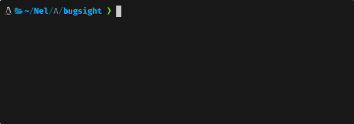

# bugsight

[](https://github.com/Arnel-rah/bugsight/actions)
[](https://crates.io/crates/bugsight)
[](https://crates.io/crates/bugsight)

> Debug smarter, not harder.

A fast Rust CLI that analyzes errors, stack traces and logs — and tells you exactly how to fix them.



---

## Install
```bash
cargo install bugsight
```

---

## Usage
```bash
# Pipe any command output
cargo build 2>&1 | bugsight

# Explain an error directly
bugsight --explain 'permission denied'

# Analyze a log file
bugsight --file logs/error.log

# Show error history
bugsight --history

# Show error statistics
bugsight --stats

# Machine-readable JSON output
bugsight --explain 'NullPointerException' --json

# Create config file
bugsight --init
```

---

## Supported languages

| Language | Errors covered |
|---|---|
| Rust | panics, compile errors, unwrap errors |
| Go | nil pointer, index out of range, missing modules |
| Python | ModuleNotFoundError, TypeError, KeyError, IndentationError |
| Node.js | Cannot find module, undefined property, EADDRINUSE |
| Docker | daemon not running, permission denied, port conflicts |
| Git | merge conflicts, push rejected, SSH errors |
| Java | NullPointerException, OutOfMemoryError, StackOverflow |
| PHP | syntax errors, memory limit, undefined variables |
| Ruby | NoMethodError, LoadError, Rails RecordNotFound |
| C/C++ | segfault, memory leaks, linker errors, buffer overflow |
| General | permission denied, file not found |

---

## AI fallback

For unknown errors, bugsight uses [Groq](https://console.groq.com) (free):
```bash
export GROQ_API_KEY=gsk_xxxxxx
```

Without the key, bugsight still works with its built-in parsers.

---

## Config
```bash
bugsight --init
```

Creates `~/.bugsight.toml`:
```toml
# Enable AI fallback
ai_enabled = true

# Save analyzed errors to history
history_enabled = true

# Language: "en" or "fr"
language = "en"

# Max errors in history
max_history = 100
```

---

## JSON output
```bash
bugsight --explain 'permission denied' --json
```
```json
{
  "error_type": "Permission Error",
  "message": "permission denied",
  "suggestion": "Try running with sudo or check file permissions with ls -la."
}
```

---

## Stats
```bash
bugsight --stats
```
```
Error Statistics
────────────────────────────────────────
Type                           Count
────────────────────────────────────────
Permission Error               3  75% ███
Runtime Panic                  1  25% █
────────────────────────────────────────
Total errors analyzed: 4
```

---

## Contributing

Contributions are welcome! The easiest way is to add a new parser.

1. Fork the repo
2. Create a branch: `git checkout -b feat/your-parser`
3. Add `src/parsers/your_lang.rs`
4. Register it in `src/parsers/mod.rs`
5. Add tests
6. Run `cargo test`
7. Open a Pull Request

See [CONTRIBUTING.md](CONTRIBUTING.md) for details.

---

## Built with

- [Rust](https://www.rust-lang.org/)
- [clap](https://github.com/clap-rs/clap)
- [colored](https://github.com/mackwic/colored)
- [Groq](https://groq.com)

---

## License

MIT © 2025 Arnel Raharinandrasana